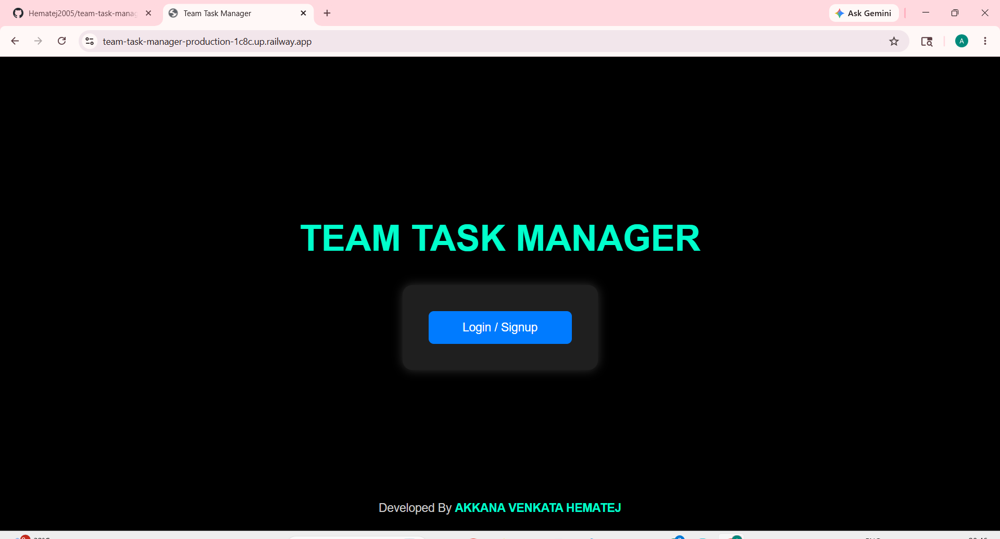
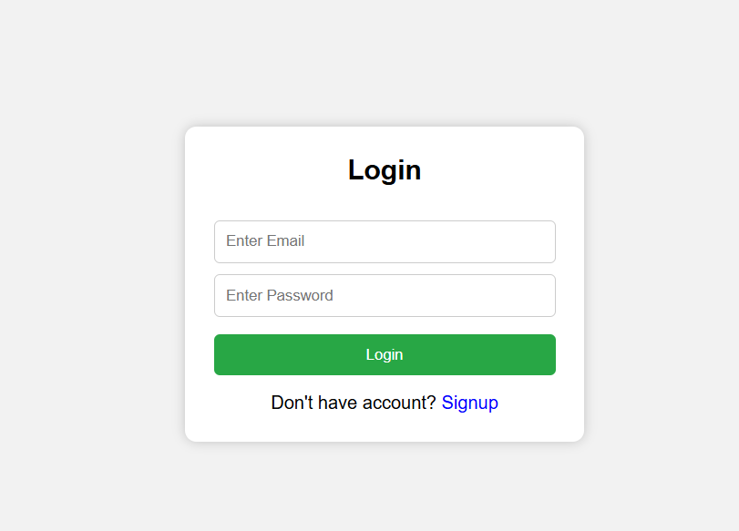
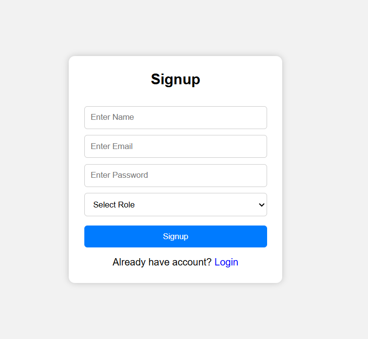
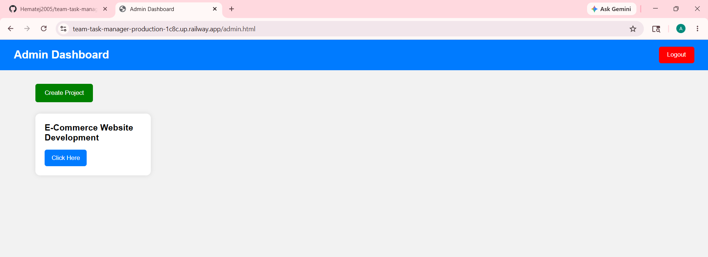
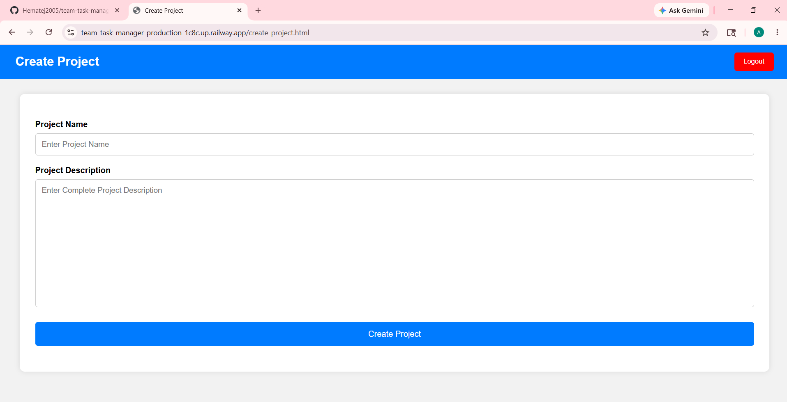
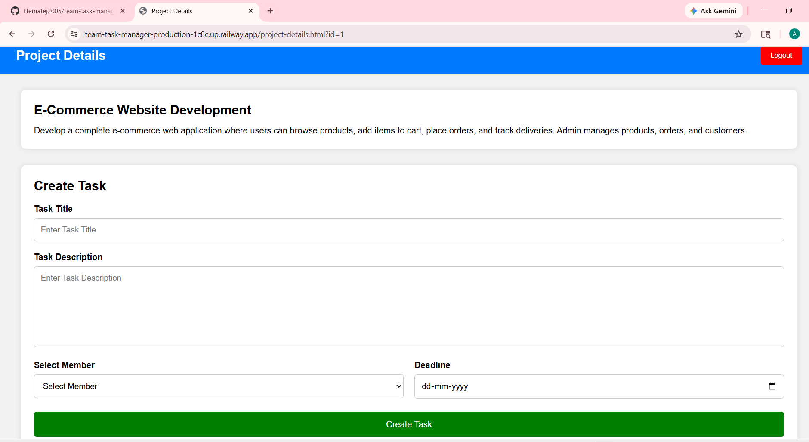
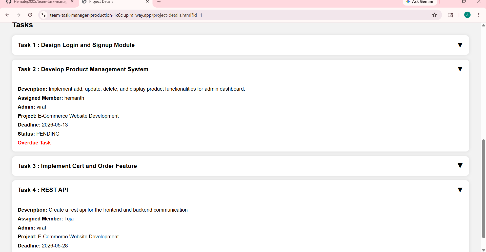
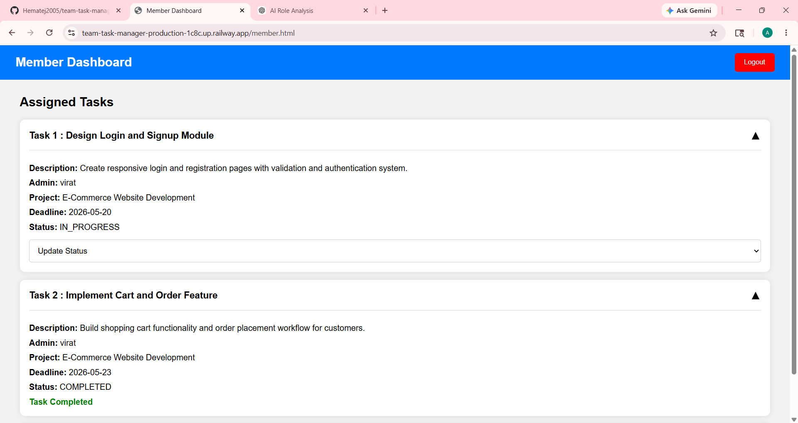

# 🚀 Team Task Manager

A Full-Stack Role-Based Task Management Web Application built using **Java Spring Boot**, **MySQL**, **Spring Security**, **JWT Authentication**, **HTML**, **CSS**, and **JavaScript**.

---

# 🌐 Live Deployment

## 🔗 Live Application

👉 https://team-task-manager-production-1c8c.up.railway.app

## ⚠️ Note

 If the deployed Railway domain shows errors like:

 ```text
 DNS_PROBE_FINISHED_NXDOMAIN
 ```

 or

 ```text
 This site can’t be reached
 ```

 it may be caused by local DNS cache or network DNS resolution issues.

 ### ✅ Solution

 Change your DNS server to:

 #### Google DNS

 ```text
 Preferred DNS : 8.8.8.8
 Alternate DNS : 8.8.4.4
 ```

 #### OR Cloudflare DNS

 ```text
 Preferred DNS : 1.1.1.1
 Alternate DNS : 1.0.0.1
 ```

 After changing the DNS:

 - Restart the browser
 - Refresh the network connection
 - Reopen the deployed URL

 The application should work properly after DNS propagation.

---

# 📌 Project Overview

Team Task Manager is a modern full-stack web application designed to simplify project coordination and task management inside organizations and teams.

The application provides separate functionalities for:

- 👨‍💼 Admin
- 👨‍💻 Team Members

Admins can create projects, assign tasks, manage deadlines, and monitor progress, while members can manage assigned tasks and update their work status.

The project follows a secure role-based architecture using Spring Security and JWT Authentication with HTTP-only cookies for enhanced security.

---

# ✨ Key Features

# 🔐 Authentication & Authorization

- User Registration
- User Login
- JWT Token Authentication
- HTTP-Only Cookie Authentication
- Secure Logout Functionality
- Role-Based Access Control
- Protected APIs using Spring Security
- Stateless Authentication using JWT

---

# 👨‍💼 Admin Functionalities

- Create New Projects
- Add Project Descriptions
- View All Projects
- Open Project Details
- Assign Tasks to Team Members
- Set Task Deadlines
- Monitor Task Progress
- Track Member Activities
- Expandable Task View Interface

---

# 👨‍💻 Member Functionalities

- View Assigned Tasks
- Accept Assigned Tasks
- Update Task Status
- Mark Tasks as Completed
- View Project Information
- View Admin Details
- Track Deadlines and Progress

---

# 🔄 Task Workflow

```text
PENDING → ACCEPTED → IN_PROGRESS → COMPLETED
```

This workflow helps teams monitor the exact progress stage of every task inside the project.

---

# 🛠️ Tech Stack

## Backend
- Java 21
- Spring Boot
- Spring Security
- Spring Data JPA
- JWT Authentication
- Maven

## Frontend
- HTML5
- CSS3
- JavaScript

## Database
- MySQL

## Deployment
- Railway

---

# 🏗️ System Architecture

The application follows a layered MVC architecture with clean separation of responsibilities.

```text
Controller Layer
       ↓
Service Layer
       ↓
Repository Layer
       ↓
Database Layer
```

---

# 🔒 Security Implementation

The application implements secure authentication and authorization mechanisms using:

- JWT Token Generation
- JWT Validation Filter
- HTTP-Only Cookies
- Stateless Session Management
- Role-Based Route Protection
- Spring Security Filter Chain

---

# 📂 Project Modules

## Authentication Module

Handles:

- Signup
- Login
- Logout
- JWT Cookie Management

---

## Project Management Module

Handles:

- Project Creation
- Project Listing
- Project Details

---

## Task Management Module

Handles:

- Task Assignment
- Task Updates
- Task Status Tracking
- Deadline Management

---

# 📸 Application Screenshots

## 🏠 Home Page



---

## 🔑 Login & Signup Pages

| Login Page | Signup Page |
|------------|-------------|
|  |  |

---

## 👨‍💼 Admin Dashboard

| Admin Dashboard | Create Project |
|-----------------|----------------|
|  |  |

---

## ✅ Task Creation & Task List

| Create Task | Task List |
|-------------|------------|
|  |  |

---

## 👨‍💻 Member Dashboard



---

# ⚙️ Installation & Setup

## 1️⃣ Clone Repository

```bash
git clone https://github.com/Hematej2005/team-task-manager.git
```

---

## 2️⃣ Open Project

Open the project in:

- IntelliJ IDEA
- VS Code
- Eclipse

---

## 3️⃣ Configure Database

Create a MySQL database:

```sql
CREATE DATABASE team_task_manager;
```

---

## 4️⃣ Configure application.properties

```properties
spring.datasource.url=jdbc:mysql://localhost:3306/team_task_manager
spring.datasource.username=root
spring.datasource.password=your_password
```

---

## 5️⃣ Run Application

Run:

```text
BackendApplication.java
```

or use:

```bash
mvn spring-boot:run
```

---

# 🚀 Deployment

The application is successfully deployed on Railway cloud platform.

## Deployment Features

- Public Domain Hosting
- MySQL Database Integration
- Automatic Build & Deploy
- Cloud-Based Runtime Environment
- Environment Variable Configuration

---

# 📊 Database Tables

The application contains the following main tables:

- users
- projects
- tasks

---

# 🧩 Entity Relationships

## User ↔ Task

One member can have multiple assigned tasks.

---

## Project ↔ Task

One project can contain multiple tasks.

---

## Admin ↔ Project

One admin can create multiple projects.

---

# 📈 Future Enhancements

- Email Notifications
- Real-Time Chat System
- File Upload Support
- Team Analytics Dashboard
- Drag & Drop Task Board
- Task Priority Levels
- Search & Filter Features
- Dark Mode UI
- Mobile Responsive Improvements
- WebSocket Real-Time Updates

---

# 🎯 Learning Outcomes

Through this project, I gained practical experience in:

- Full-Stack Development
- Spring Boot Development
- REST API Development
- Spring Security
- JWT Authentication
- Database Design
- MVC Architecture
- Railway Deployment
- Cloud Configuration
- Debugging Deployment Issues

---

# 💡 Why This Project Is Useful

This project helps organizations and teams:

- Organize project workflows efficiently
- Track team productivity
- Manage deadlines effectively
- Improve collaboration between admins and members
- Monitor task completion progress in real-time

---

# 📜 API Features

The backend exposes secure REST APIs for:

- Authentication
- Project Management
- Task Management
- Member Operations

All APIs are protected using JWT authentication and Spring Security authorization.

---

# 🧠 Challenges Faced During Development

- Implementing secure JWT authentication
- Managing role-based authorization
- Configuring HTTP-only cookie authentication
- Handling Railway cloud deployment
- Solving DNS and deployment networking issues
- Designing task workflow management

---

# 📌 Project Status

```text
✅ Completed and Successfully Deployed
```

---

# 👨‍💻 Developer

## Akkana Venkata Hematej

### B.Tech — Artificial Intelligence and Data Science

Aspiring Java Backend Developer & Full-Stack Developer

---

# ⭐ Conclusion

Team Task Manager is a secure and scalable task management application developed using modern Java backend technologies and cloud deployment practices.

The project demonstrates real-world implementation of:

- Authentication & Authorization
- JWT Security
- REST APIs
- Database Integration
- MVC Architecture
- Railway Cloud Deployment
- Full-Stack Application Development

---

# 🙌 Thank You

Thank you for visiting this project repository.

If you found this project useful, feel free to give it a ⭐ on GitHub.
